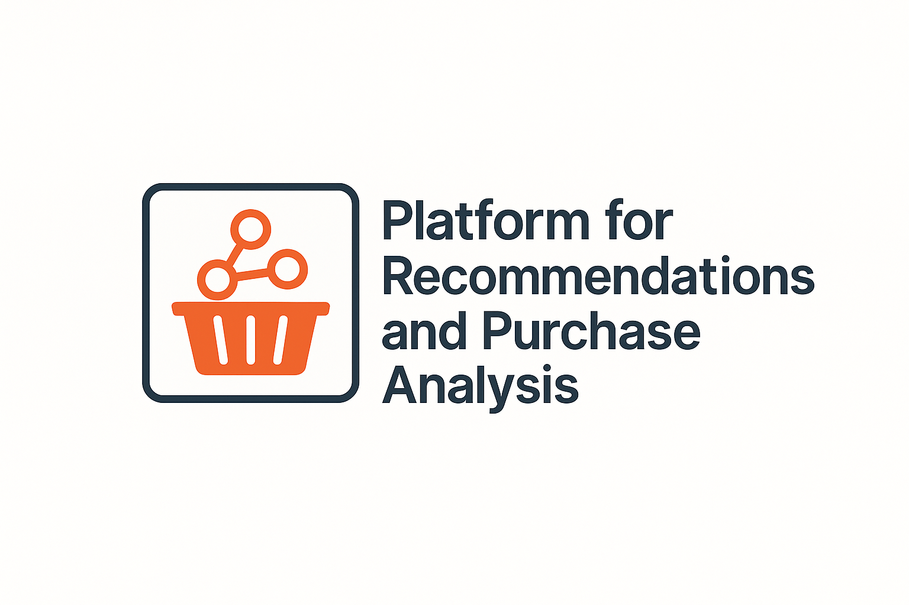

# Platform for Recommendations and Purchase Analysis

> Build a modern backend with DDD + event streaming + distributed processing.
<p align="center">
  
</p>
---

## 🧠 Project Idea

The goal is to develop an architecture that combines:

- ✅ **Domain-Driven Design**
- 🧱 **Hexagonal Architecture**
- ⚡ **Event-driven communication**
- 🔥 **Big Data processing (Spark)**

All together to deliver **real-time personalized recommendations** based on user purchase history.


---

## 🛠️ Technologies to be used


---

## 🧩 Modelling and Relationships

### 📦 Main entities:

- **User**: registered user.
- **Product**: product available for purchase.
- **Purchase**: represents a purchase made.
- **Recommendation**: recommendation generated to a user.

### 🔗 Relationships:

```plaintext
[User] 1 --- * [Purchase] * --- 1 [Product]

[User] 1 --- * [Recommendation] * --- --- 1 [Product]
```

### 📡Events:
 
| Event                          | Description                                          |
| ------------------------------ | ---------------------------------------------------- |
| `UserRegisteredEvent`          | Emitted when registering a new user                  |
| `ProductAddedEvent`            | Emitted when a new product is added.                 |
| `PurchaseMadeEvent`            | Emitted when a purchase is made.                     |
| `RecommendationGeneratedEvent` | Emitted by Spark when a recommendation is generated. |

### 🧱 Bounded Contexts
| Context          | Main Responsability                                   |
| ---------------- | ----------------------------------------------------- |
| `user`           | User registration and management                      |
| `product`        | Product catalogue management                          |
| `purchase`       | Registration of user purchases                        |
| `recommendation` | Processing and generation of recommendations (Spark)  |

### 🏗️ Architecture
A hexagonal architecture is adopted, with clear separation between:

🔸 **Domain**: business logic, entities, events, value objects.

🔸 **Application**: use cases and orchestration.

🔸 **Infrastructure**: technical integration with database, events, Spark, etc.

Modular structure in a single microservice. In the future I want to create one microservices for any bounded context.

